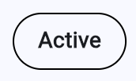
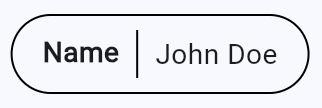

# pill_widget

A customizable pill/chip widget for Flutter with inline editing support. Display labels with optional editable values in a sleek pill-shaped container.

## Features

- Display a label-only pill or a label with an editable value
- Inline editing with tap-to-edit functionality
- Clean pill-shaped design with customizable appearance
- Lightweight with no external dependencies

## Screenshots

|   |   |
|---|---|
|  |  |
|  |  |

## Installation

Add this to your package's `pubspec.yaml` file:

```yaml
dependencies:
  pill_widget: ^0.0.1
```

Then run:

```bash
flutter pub get
```

## Usage

### Basic Label-Only Pill

```dart
import 'package:pill_widget/pill_widget.dart';

Pill(
  label: 'Status',
)
```

### Pill with Editable Value

```dart
Pill(
  label: 'Name',
  value: 'John Doe',
  onValueChanged: (newValue) {
    print('Value changed to: $newValue');
  },
)
```

### Example

```dart
import 'package:flutter/material.dart';
import 'package:pill_widget/pill_widget.dart';

class MyWidget extends StatefulWidget {
  @override
  State<MyWidget> createState() => _MyWidgetState();
}

class _MyWidgetState extends State<MyWidget> {
  String _name = 'John Doe';

  @override
  Widget build(BuildContext context) {
    return Wrap(
      spacing: 8,
      children: [
        Pill(label: 'Active'),
        Pill(
          label: 'Name',
          value: _name,
          onValueChanged: (newValue) {
            setState(() {
              _name = newValue;
            });
          },
        ),
      ],
    );
  }
}
```

## API Reference

### Pill

| Property | Type | Description |
|----------|------|-------------|
| `label` | `String` | Required. The label text displayed on the left side of the pill. |
| `value` | `String?` | Optional. The editable value displayed on the right side. When null, only the label is shown. |
| `onValueChanged` | `ValueChanged<String>?` | Optional. Callback fired when the value is changed through inline editing. |

## License

MIT License - see the [LICENSE](LICENSE) file for details.
