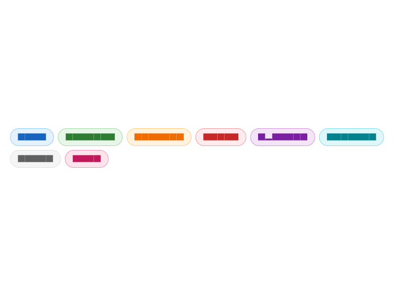
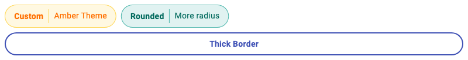
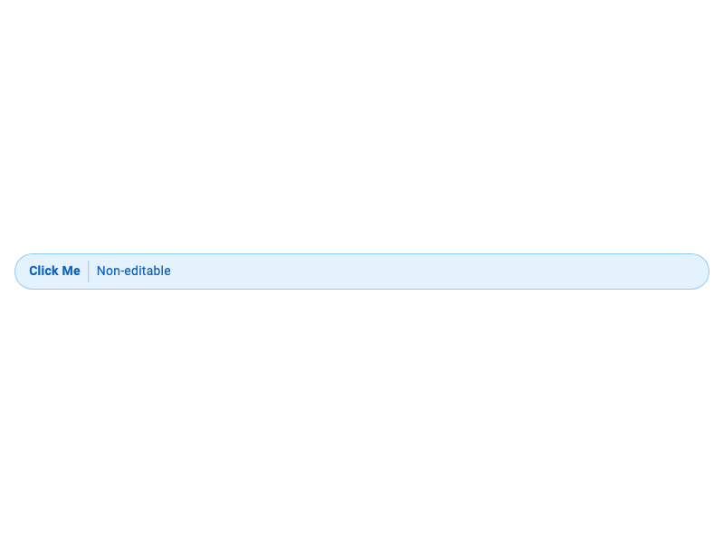

# pill_widget

A customizable pill/chip widget for Flutter with inline editing support and extensive styling options. Display labels with optional editable values in a sleek pill-shaped container.

## Features

- Display a label-only pill or a label with an editable value
- Inline editing with tap-to-edit functionality
- **Comprehensive styling with `PillStyle`**
- **8 predefined color presets via `PillStyles`**
- **Read-only mode with `editable` parameter**
- **Tap handling with `onTap` callback**
- Clean pill-shaped design
- Lightweight with no external dependencies

## Screenshots

| | |
|---|---|
| **Basic Pills**<br> | **Editable Pills**<br> |
| **Styled Pills**<br> | **Styled Pills with Values**<br> |
| **Custom Styles**<br> | **Read-only**<br> |

## Installation

Add this to your package's `pubspec.yaml` file:

```yaml
dependencies:
  pill_widget: ^0.1.0
```

Then run:

```bash
flutter pub get
```

## Usage

### Basic Label-Only Pill

```dart
import 'package:pill_widget/pill_widget.dart';

Pill(label: 'Status')
```

### Pill with Value

```dart
Pill(
  label: 'Name',
  value: 'John Doe',
)
```

### Editable Pill

```dart
Pill(
  label: 'Name',
  value: _name,
  onValueChanged: (newValue) {
    setState(() {
      _name = newValue;
    });
  },
)
```

### Styled Pills (Using Presets)

```dart
// Use predefined color presets
Pill(label: 'Info', style: PillStyles.info)
Pill(label: 'Success', style: PillStyles.success)
Pill(label: 'Warning', style: PillStyles.warning)
Pill(label: 'Error', style: PillStyles.error)
Pill(label: 'Special', style: PillStyles.special)
Pill(label: 'Neutral', style: PillStyles.neutral)
Pill(label: 'Muted', style: PillStyles.muted)
Pill(label: 'Date', style: PillStyles.date)
```

### Custom Styling

```dart
Pill(
  label: 'Custom',
  value: 'Styled',
  style: PillStyle(
    backgroundColor: Colors.amber.shade50,
    borderColor: Colors.amber.shade300,
    labelColor: Colors.amber.shade900,
    borderRadius: 32,
    borderWidth: 2.0,
  ),
)
```

### Read-Only Pill with Tap Handler

```dart
Pill(
  label: 'Click Me',
  value: 'Non-editable',
  editable: false,
  style: PillStyles.info,
  onTap: () {
    print('Pill tapped!');
  },
)
```

## API Reference

### Pill

| Property | Type | Description |
|----------|------|-------------|
| `label` | `String` | Required. The label text displayed on the left side of the pill. |
| `value` | `String?` | Optional. The value displayed on the right side. When null, only the label is shown. |
| `onValueChanged` | `ValueChanged<String>?` | Optional. Callback fired when the value is changed through inline editing. |
| `style` | `PillStyle?` | Optional. Style configuration for customizing appearance. |
| `editable` | `bool` | Whether the value can be edited. Defaults to `true`. |
| `onTap` | `VoidCallback?` | Optional. Callback fired when the pill is tapped. |

### PillStyle

| Property | Type | Default | Description |
|----------|------|---------|-------------|
| `backgroundColor` | `Color?` | transparent | Background color of the pill. |
| `borderColor` | `Color?` | black | Border color of the pill. |
| `labelColor` | `Color?` | black | Color of the label text. |
| `valueColor` | `Color?` | labelColor | Color of the value text. |
| `dividerColor` | `Color?` | borderColor | Color of the divider between label and value. |
| `borderWidth` | `double?` | 1.0 | Width of the border. |
| `borderRadius` | `double?` | 24.0 | Border radius of the pill. |
| `labelFontWeight` | `FontWeight?` | bold | Font weight of the label. |
| `valueFontWeight` | `FontWeight?` | normal | Font weight of the value. |
| `fontSize` | `double?` | theme default | Font size for text. |

### PillStyles (Presets)

| Style | Description |
|-------|-------------|
| `PillStyles.defaultStyle` | Black border on transparent background |
| `PillStyles.info` | Blue theme for informational content |
| `PillStyles.success` | Green theme for positive states |
| `PillStyles.warning` | Orange theme for warnings |
| `PillStyles.error` | Red theme for errors |
| `PillStyles.special` | Purple theme for highlighted content |
| `PillStyles.neutral` | Cyan theme for secondary content |
| `PillStyles.muted` | Grey theme for disabled content |
| `PillStyles.date` | Pink theme for temporal content |

## Migration from 0.0.x

The 0.1.0 release is fully backward compatible. Existing code will continue to work without changes. The new `style`, `editable`, and `onTap` parameters are optional additions.

## License

MIT License - see the [LICENSE](LICENSE) file for details.
